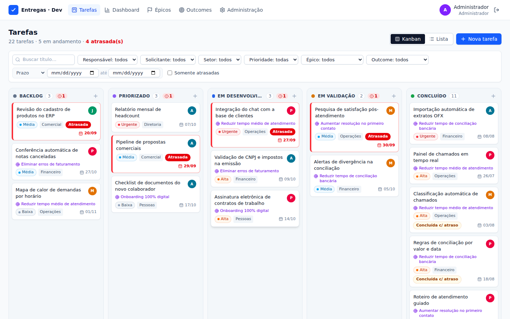

# Acompanhamento de Entregas — Desenvolvimento

Sistema web interno (MVP) para acompanhar as entregas da área de Desenvolvimento:
**Épico → Outcome → Tarefas**, Kanban, lista, indicadores de fluxo e indicadores de negócio.



## Funcionalidades

- **Tarefas** em Kanban (arrastar-e-soltar entre status) ou Lista (ordenável), com filtros combináveis:
  status, responsável, solicitante, setor, prioridade, épico, outcome, período e "somente atrasadas".
- **Regras automáticas**: data de criação, início real e conclusão real preenchidos pelas mudanças
  de status (baseadas em flags configuráveis, não no nome), indicação de atraso e histórico completo.
- **Épicos** (ligados a um OKR) e **Outcomes** com indicador de negócio (baseline → atual → meta).
- **Priorização ICE** em tarefas e outcomes: Impacto, Confiança e Facilidade (1–10) e ICE score
  calculado automaticamente (impacto × confiança × facilidade), com ordenação por qualquer um deles.
- **Dashboard**: Cycle Time, Lead Time, Throughput, tarefas criadas, WIP, atrasadas e Aging, com
  filtros por período, responsável, setor, épico e outcome.
- **Administração** (somente administradores): usuários, setores e status (ordem, cor, padrão, início,
  conclusão, WIP, encerra sem entrega, ativo).
- **Lixeira**: tarefas excluídas ficam 30 dias e podem ser restauradas por qualquer usuário; depois são
  removidas automaticamente. Esvaziar a lixeira / excluir definitivamente: somente administradores.
- Login simples com perfis Administrador e Usuário.

Detalhes de arquitetura, modelo de dados, regras e fórmulas: **[docs/ARQUITETURA.md](docs/ARQUITETURA.md)**.

## Como rodar localmente

Requisitos: **Node.js 22.13+** (recomendado: versão LTS atual). Nada mais: o banco usa o SQLite
embutido no Node, então o `npm install` não precisa compilar nada (nem Python, nem Visual Studio).

No Windows, use o **Prompt de Comando (cmd)** — o PowerShell pode bloquear o `npm`.

```bash
npm install        # instala server e client (workspaces)
npm run seed       # cria data/app.db com dados de demonstração (apaga o banco existente!)
npm run dev        # API em :3001 e frontend em http://localhost:5173
```

Acessos de demonstração:

| Usuário | E-mail | Senha | Perfil |
|---|---|---|---|
| Administrador | admin@empresa.com | admin123 | Administrador |
| João | joao@empresa.com | 123456 | Administrador |
| Maria, Pedro, Ana | maria@ / pedro@ / ana@empresa.com | 123456 | Usuário |

## Importar a planilha de demandas (CSV)

Com o sistema **desligado**, na pasta do projeto:

```bash
npm run importar -- caminho\planilha.csv --simular   # mostra o que seria importado, sem gravar
npm run importar -- caminho\planilha.csv             # importa de fato
```

- Antes de gravar, é feita uma cópia de segurança do banco em `data/backups/`.
- Pode ser executado de novo sem duplicar: tarefas com o mesmo título são ignoradas.
- Aceita o CSV exportado pelo Excel (Windows-1252 ou UTF-8; vírgula ou ponto e vírgula; datas
  mês/dia/ano ou dia/mês/ano, detectadas automaticamente).
- Regras de conversão (status, setores, títulos, observações etc.) documentadas no início de
  `server/src/db/import-csv.ts`.

## Produção

```bash
npm install
npm run build                  # compila frontend e backend
NODE_ENV=production npm start  # um único processo: http://localhost:3001
```

Em um banco vazio (sem seed), a primeira execução cria o administrador (`ADMIN_EMAIL` /
`ADMIN_PASSWORD`, padrão `admin@empresa.com` / `admin123`) e o fluxo de status padrão.
Troque a senha em **Administração → Usuários**.

Variáveis de ambiente (todas opcionais):

| Variável | Padrão | Descrição |
|---|---|---|
| `PORT` | `3001` | Porta HTTP |
| `DB_PATH` | `data/app.db` | Arquivo SQLite (backup = copiar o arquivo) |
| `APP_TIMEZONE` | `America/Sao_Paulo` | Fuso de negócio para datas, atrasos e períodos |
| `SESSION_DAYS` | `7` | Validade da sessão |
| `TRASH_DAYS` | `30` | Dias que uma tarefa excluída fica na lixeira antes da remoção definitiva |
| `ADMIN_EMAIL`, `ADMIN_PASSWORD` | — | Administrador inicial em banco vazio |
| `COOKIE_SECURE` | `false` | Use `true` ao servir via HTTPS |

## Testes

```bash
npm test           # regras de negócio, fuso horário, métricas e API (Vitest)
npm run typecheck  # TypeScript do backend e frontend
```

## Estrutura

```
server/
  src/config.ts               configuração central (porta, banco, fuso)
  src/db/                     conexão, migrations, bootstrap e seed
  src/lib/                    auth, datas/fuso, validação, erros HTTP
  src/modules/                um módulo por entidade
    tasks/rules.ts            regras puras de status e atraso
    tasks/service.ts          criação, edição, mudança de status, histórico, filtros
    dashboard/metrics.ts      cálculo puro dos indicadores
  tests/                      testes de regras e de API
client/
  src/pages/                  Tarefas, Dashboard, Épicos, Outcomes, Administração, Login
  src/components/             Kanban, lista, filtros, modal de tarefa, componentes de UI
  src/lib/                    cliente da API, autenticação, formatação (fuso), queries
docs/ARQUITETURA.md           arquitetura, modelo de dados, regras e fórmulas
```
